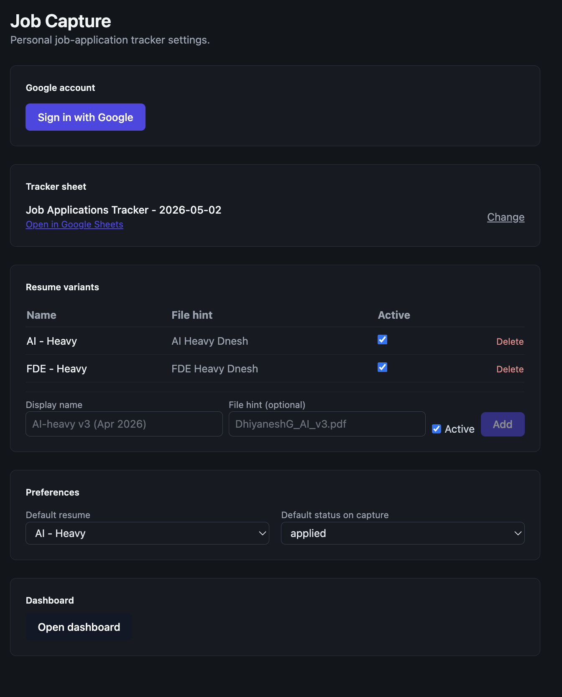
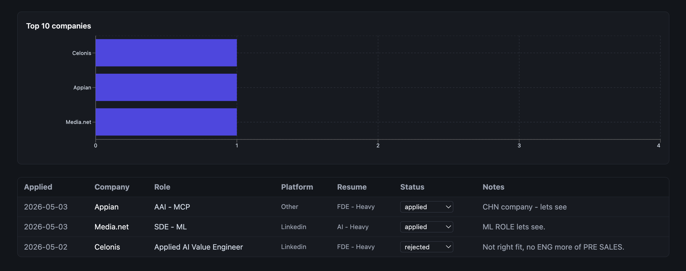

# jobclip

> One-click capture of job postings from **LinkedIn, Greenhouse, Lever, Ashby, and Workday** straight into your own Google Sheet — with a local dashboard for pattern analysis.

[](LICENSE)
[](manifest.config.ts)
[](package.json)
[](package.json)

---

## Demo

<!-- Capture screenshots / GIF per docs/CAPTURE_CHECKLIST.md and drop them in docs/images/ -->

<p align="center">
  
</p>

<p align="center">
  
</p>

<!-- End-to-end screen recording: docs/demo.gif -->

---

## Why I built this

I was job-hunting and tired of manually copy-pasting role, company, location, comp, and JD links into a spreadsheet — while also losing track of which resume variant I sent where. **jobclip** is a personal MV3 extension that does the boring work in one click and lets me spend my attention on the actual interviews.

Along the way it was a good excuse to ship a non-trivial Chrome extension end-to-end: MV3 service workers, site-specific DOM parsers, JSON-LD fallbacks, OAuth via `chrome.identity`, and a React dashboard backed entirely by the user's own Google Drive (no servers of my own).

---

## Features

- **One-click capture** from the toolbar icon, right-click menu, or `Cmd/Ctrl+Shift+J`.
- **Site-aware parsers** for LinkedIn, Greenhouse, Lever, Ashby, Workday — plus a generic JSON-LD / OpenGraph fallback for anything else.
- **Auto-extracted fields**: company, role, location, salary (USD/INR/GBP), years of experience, skills.
- **Resume variant picker** — register your resumes once, tag each application with the version you sent.
- **Status tracking** — Applied, Phone Screen, Onsite, Offer, Rejected, etc.; update later without leaving the site.
- **Google Sheets as the store** — data lives in *your* Drive. Dedup by URL, three tabs (`applications`, `resumes`, `meta`).
- **Local dashboard** with five Recharts views: applications over time, status funnel, resume performance, platform breakdown, top companies.
- **CSV export** for offline analysis.
- **No backend, no telemetry.**

---

## Tech stack

| Layer | Tools |
|---|---|
| Extension | Chrome Manifest V3, `@crxjs/vite-plugin` |
| Frontend | React 18, TypeScript 5, Tailwind CSS, Recharts |
| Build | Vite 5, PostCSS, Autoprefixer |
| Storage | `chrome.storage`, Google Sheets API v4 via `chrome.identity` OAuth |
| Validation | Zod |
| Tests | Vitest + happy-dom, HTML fixtures per parser |

---

## Architecture

```
           ┌─────────────────────────┐
           │  content script         │   site-specific parser
  page  →  │  (LinkedIn / GH / …)    │   + JSON-LD fallback
           └───────────┬─────────────┘
                       │ parsed fields
                       ▼
           ┌─────────────────────────┐
           │  popup (React)          │   user confirms +
           │  field review + resume  │   picks resume + status
           └───────────┬─────────────┘
                       │ save
                       ▼
           ┌─────────────────────────┐
           │  background SW          │   OAuth → Sheets API
           │  append row, dedup URL  │
           └───────────┬─────────────┘
                       │
                       ▼
              Google Sheet  ──►  dashboard (Recharts)
```

Full design doc: [TDD.md](TDD.md).

---

## Setup

### 1. Create a Google Cloud OAuth client

The extension uses `chrome.identity` to talk to Google Sheets. You need your own OAuth client because Chrome extensions are per-install.

1. Go to <https://console.cloud.google.com/>. Create a new project (e.g., `jobclip`).
2. **APIs & Services → Library** → enable **Google Sheets API** and **Google Drive API**.
3. **APIs & Services → OAuth consent screen** → External → add yourself as a test user. Scopes: `.../auth/spreadsheets` and `.../auth/drive.file`.
4. **APIs & Services → Credentials → Create Credentials → OAuth client ID** → *Chrome Extension* type.
5. Copy the **Client ID** (ends with `.apps.googleusercontent.com`).

### 2. Wire the Client ID

Replace `REPLACE_WITH_YOUR_OAUTH_CLIENT_ID.apps.googleusercontent.com` in:

- [`src/lib/config.ts`](src/lib/config.ts)
- [`manifest.config.ts`](manifest.config.ts) (if referenced there)

### 3. Build and load the extension

```bash
npm install
npm run build
```

Then in Chrome / Arc:

1. Open `chrome://extensions` and enable **Developer mode**.
2. **Load unpacked** → pick the `dist/` folder.
3. Copy the extension ID and paste it into your Google Cloud OAuth client's **Item ID** field.

### 4. First-run

Click the jobclip icon → **Sign in with Google** → **Create new tracker** (or paste an existing Sheet URL) → add your resume variants. Ready.

---

## Development

```bash
npm run dev          # vite dev with HMR — reload extension after bg/content-script changes
npm run build        # production build → dist/
npm run test         # vitest: parser + extractor suites
npm run typecheck    # tsc --noEmit
```

### Adding a new platform

1. Save a representative HTML page to `tests/fixtures/<platform>-sample.html`.
2. Write a failing test in `tests/parsers.test.ts`.
3. Implement `src/content/parsers/<platform>.ts` following `greenhouse.ts`.
4. Register it in `src/content/index.ts` (`SITE_PARSERS` array).
5. Add the URL pattern to `manifest.config.ts` → `content_scripts.matches` and `host_permissions`.
6. Rebuild, reload.

---

## Privacy

- All data lives in **your** Google account and local `chrome.storage`. No external servers, no telemetry.
- Your OAuth client is your own — don't share the client ID publicly if you ever publish this extension.

---

## Known limitations

- **LinkedIn** selectors drift when LinkedIn ships DOM changes. Low-confidence fields are highlighted yellow in the popup — verify before saving. When breakage happens: save a fresh fixture, update selectors, rebuild.
- **Workday** is multi-tenant; DOM varies per employer. Most tenants embed JSON-LD (parser uses it first); DOM fallback is best-effort.
- **Dedup** is URL-based. If a posting moves URLs, you may get duplicate rows — filter by company+role in the dashboard.

---

## License

Apache License 2.0 — see [LICENSE](LICENSE).
